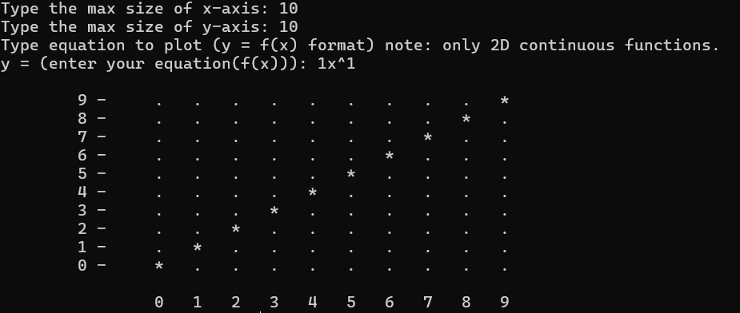

# Simple Graph Plotter
this is an attempt at visualizing simple 2-D graphs on command line 
using ASCII characters.
# features
- You can input 2-D binomial equation of any degree to visualize the graph.  

    